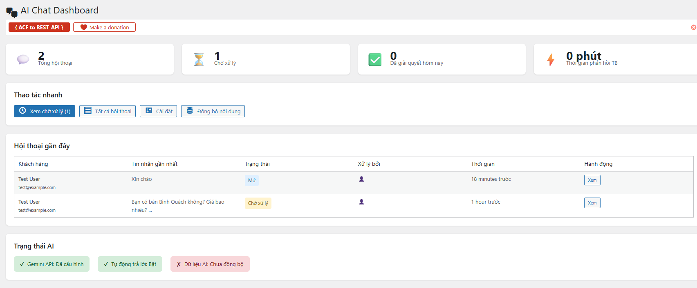
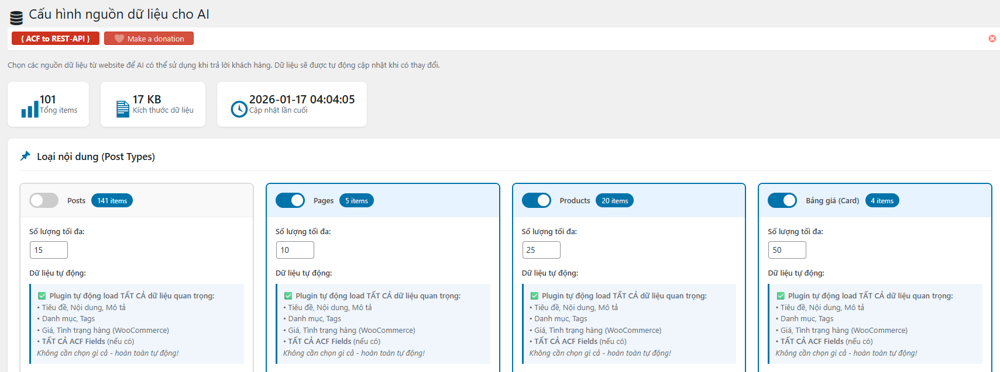
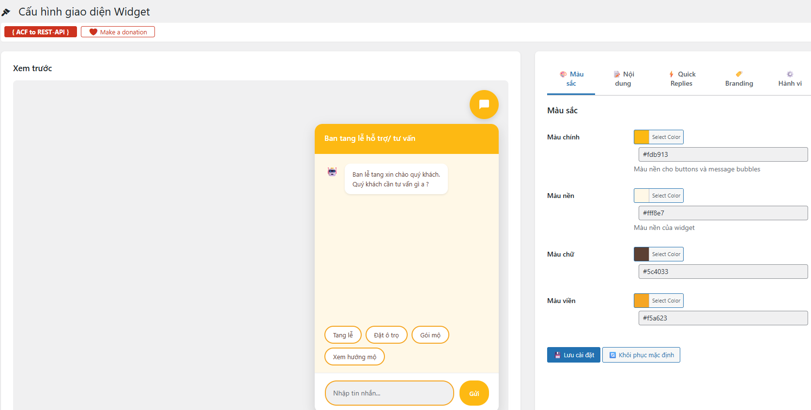
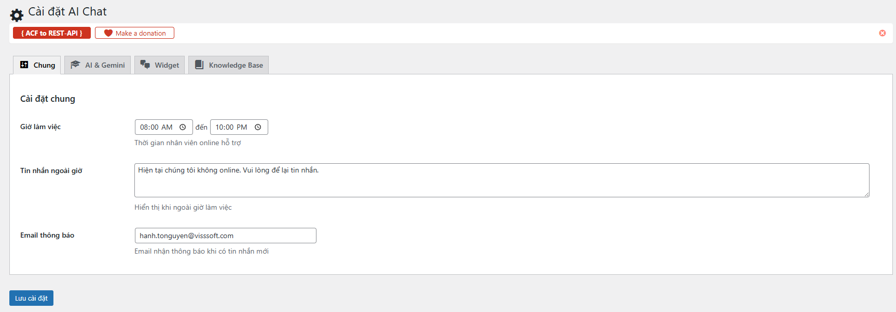

# Visssoft AI Chat Support

**Plugin chat hỗ trợ khách hàng thông minh tích hợp Google Gemini AI và công nghệ RAG (Retrieval-Augmented Generation).**

Visssoft AI Chat Support biến website WordPress của bạn thành một trung tâm hỗ trợ khách hàng tự động 24/7. Plugin sử dụng mô hình ngôn ngữ lớn (LLM) Gemini của Google để trả lời câu hỏi của khách truy cập một cách tự nhiên, chính xác dựa trên chính nội dung website của bạn (Bài viết, Sản phẩm, Dịch vụ, etc.).

## 🚀 Tính Năng Nổi Bật

### 🤖 AI Thông Minh (Gemini Integration)
*   **Tích hợp Google Gemini**: Sử dụng mô hình AI tiên tiến để hiểu và phản hồi ngôn ngữ tự nhiên tiếng Việt mượt mà.
*   **Học từ dữ liệu thật (RAG)**: AI tự động "đọc" và "hiểu" nội dung từ các Post Type bạn chọn (Post, Page, Product,...) để trả lời chính xác thông tin doanh nghiệp, không bịa đặt.
*   **Context Aware**: AI ghi nhớ ngữ cảnh cuộc trò chuyện để phản hồi liên tục.

### 💬 Chat Widget Hiện Đại & Tùy Biến
*   **Giao diện đẹp mắt**: Widget chat hiện đại, responsive, hoạt động tốt trên cả Desktop và Mobile.
*   **Tùy biến cao**: Dễ dàng thay đổi màu sắc, vị trí, tiêu đề, lời chào và logo thương hiệu.
*   **Quick Replies**: Cấu hình các câu hỏi thường gặp để khách hàng chọn nhanh.
*   **Offline Mode**: Tự động chuyển sang chế độ để lại tin nhắn khi ngoài giờ làm việc (cấu hình Business Hours).

### 🛠️ Quản Trị Mạnh Mẽ
*   **Dashboard Trực Quan**: Xem thống kê tin nhắn, số lượng hội thoại, và tình trạng AI hoạt động.
*   **Quản Lý Hội Thoại**: Admin có thể xem lịch sử chat, tham gia chat trực tiếp (Human Takeover) hoặc trả lời tin nhắn của khách.
*   **Đồng Bộ Dữ Liệu**: Cơ chế đồng bộ thông minh giúp AI luôn cập nhật thông tin mới nhất từ website.

### 🌐 Hỗ Trợ Headless & Next.js
*   **REST API Full-featured**: Cung cấp API đầy đủ để tích hợp chat vào Mobile App hoặc Website khác.
*   **Next.js Ready**: Có sẵn module tích hợp cho Next.js (App Router & Pages Router) trong thư mục `nextjs-integration`.

## ⚙️ Yêu Cầu Hệ Thống

*   WordPress 5.0 trở lên
*   PHP 7.4 trở lên
*   Google Gemini API Key (Bắt buộc)

## 📦 Cài Đặt

1.  Tải file `.zip` plugin và upload lên WordPress (Plugins > Add New > Upload Plugin).
2.  Kích hoạt plugin **Visssoft AI Chat Support**.
3.  Truy cập menu **AI Chat > Cài đặt** trong Admin Dashboard.
4.  Nhập **Gemini API Key** của bạn.
5.  Truy cập **AI Chat > Nguồn dữ liệu** và chọn các Post Type bạn muốn AI học (ví dụ: `post`, `page`, `product`). Nhấn **Đồng bộ dữ liệu**.

## 🔌 Tích Hợp Next.js (Headless WP)

Plugin cung cấp sẵn component React để bạn nhúng vào các dự án Headless WordPress sử dụng Next.js.

Xem hướng dẫn chi tiết tại: `nextjs-integration/README.md`

## 🛡️ Bảo Mật & Hiệu Năng

*   **Rate Limiting**: Giới hạn số lượng request từ mỗi IP/Visitor để ngăn chặn spam.
*   **Caching**: Cache các câu trả lời và dữ liệu knowledge base để tăng tốc độ phản hồi và tiết kiệm token API.
*   **Secure API**: Xác thực qua Nonce cho Widget và Cookie/Auth header cho Admin API.

## 📝 Changelog

**v2.0.0**
*   Nâng cấp Gemini AI core.
*   Thêm tính năng Auto-learn từ Custom Post Types.
*   Cải thiện giao diện Admin Dashboard và Chat Widget.
*   Bổ sung REST API và tài liệu tích hợp Next.js.

---

**Developed by Visssoft**
website: [visssoft.com](https://visssoft.com)
